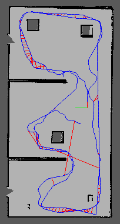

## Udacity-Robotics-Software-Engineering-Nanodegree

This repository contains Project done for Nanodegree in Robotics Software Engineer by Udacity

Course Link: [Robotics Software Engineer](www.udacity.com/course/robotics-software-engineer--nd209)

Credentials URL: [Link](https://confirm.udacity.com/27TNHC4M)

There are a total of 5 projects.

## Project 1: Build My World

### Goal

Design a Gazebo World environment including multiple models and use it as a base for the rest of my projects.

### What I learned
- Launching a Gazebo Environment
- Designing in Gazebo

## Project 2: Go Chase It

### Goal

Design and build a mobile robot, and house it in a world. Next, program the robot with nodes and services using C++ in ROS to chase a white colored ball.

### What I learned
- Building Catkin Workspaces
- ROS node creation
- ROS node communication
- Using additional ROS packages
- Gazebo world integration
- RViz integration
- rqt_graph for debugging

## Demo

## Project 3: Where Am I?

### Goal

Interface the mobile robot with the Adaptive Monte Carlo Localization (AMCL) algorithm in ROS to estimatethe robot's position as it travels through a predefined set of waypoints, and tune different parameters to increase the localization efficiency of the robot.

### What I learned
- Implementation of Adaptive Monte Carlo Localization in ROS
- How to generate a map using pgm_map_creator
- Using move_base node package
- Understanding of tuning of parameters 

## Demo with Control using the 2D Nav Goal

## Demo with Control using the teleop keyboard 

## Project 4: Map My World

### Goal

An application of [rtabmap-ros](http://wiki.ros.org/rtabmap_ros) package for simultaneous localization and mapping (SLAM) of a mobile robot. 
This project assumes known robot pose to map an environment. The robot uses camera data to recognize previously visited regions in the map using a graph-based SLAM approach known as Real-Time Appearance Based (RTAB) mapping (under the hood, bag-of-words is used for detecting loop closures). More information on this can be found [here](http://introlab.github.io/rtabmap/).

### What I learned
- Implementation of SLAM in ROS
- How to use rtabmap_ros package to generate database
- To view a database file using ` rtabmap-databaseViewer `

##

<table style="width:100%">
  <tr>
    <th>

           </a>
            World 
        

    </th>
    <th>

           </a>
            2D Map
      

    </th>
  </tr>
  <tr>
    <th>

           </a>
            Occupancy Grid
      

    </th>
    <th>

           </a>
            Detected Features
      

    </th>
  </tr>
</table>

## Project5: Home Service Robot

### Goal

Use a SLAM package to autonomously map an environment and interface robot with a path planning and navigation ROS package to move objects within an environment.

### What I learned
- Advanced ROS and Gazebo Integration
- ROS Navigation stack 7
- Path Planning
- Shell Scripting
- SLAM algorithms

## Demo
